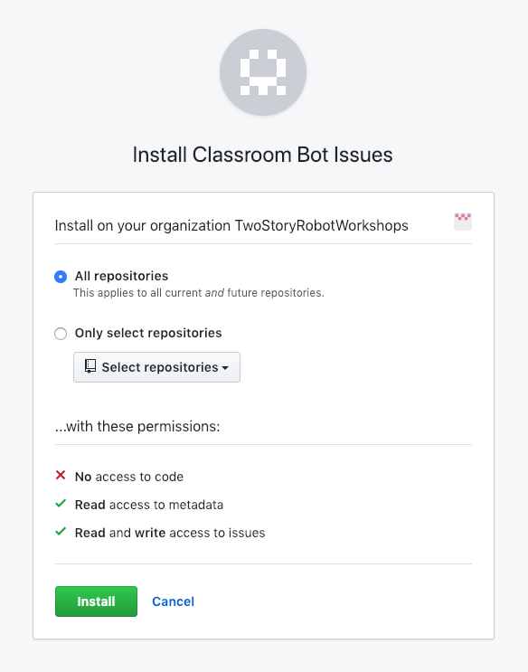

# Classroom Bot Issues

> A GitHub App built with [Probot](https://github.com/probot/probot) that copies open issues from starter repository to student assignment repositories.

## Install

Install the Classroom Bot Issues GitHub App from [the Marketplace](https://github.com/apps/classroom-bot-issues). Select the Organization in which you run your Classroom, and select install on "All repositories".



## Default

By default, issues will be copied from a repository named `<assignment-prefix>-starter`. For example, if your assignment repository prefix is `assignment1`, the App will attempt to copy all issues from `assignment1-starter` to each students' assignment repository (ie `assignment1-student1`, `assignment1-student2`, etc)

## Configure

If you need issues to be copied from a different repository, you can configure this in your starter repository. If your assignment starter repository is name `assignment1-master-copy`, then simply add the following to your `.github/config.yml`:

```yml
issues:
  starterName: assignment1-master-copy
```

## Contributing

If you have suggestions for how Classroom Bot Issues could be improved, or want to report a bug, open an issue! I'd love all and any contributions.

For more, check out the [Contributing Guide](CONTRIBUTING.md).

## License

[MIT](LICENSE.md) © 2018 Chad Fawcett
